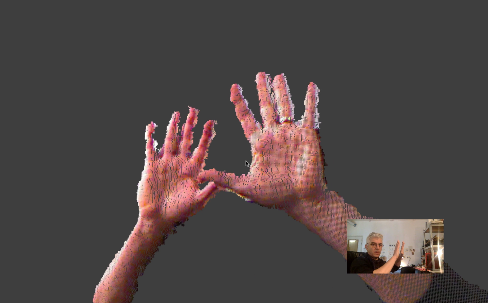
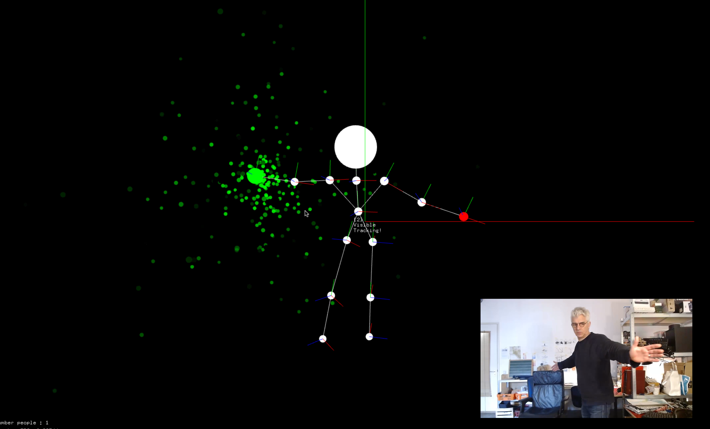
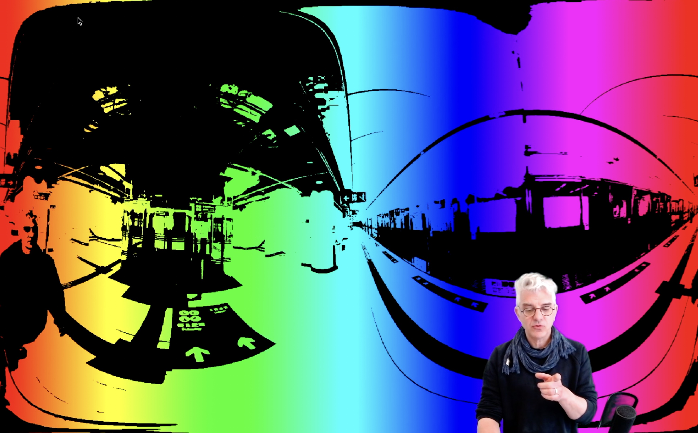

# art-and-code
Demo code from youtube video tutorials and how-tos

http://youtube.com/danbuzzo

http://twitter.com/danb_zzo

## coding for artists
A super simple introduction to c++ ideas and concepts aimed at artists and designers. Short example code in individual files

## Using openFrameworks
### kinectPhotoBooth
photobooth using kinect 1 sensor to record, colour, triangulate and save to disc 3D images

### kinect2 NI Particle Painter
using kinect2 and the openNI natural interaction, skeletal tracking toolkit and a particle system to paint with your hands.

### emoji test 
example code in response to questions on the youtube channel, taking the ascii video transform example from the openframeworks creative technology toolkit series and making it work with emojis instead.  

### slitscan examples

### dirty electro sample player

### remaking 'music for airports' generative ambient music sample player 

### videoSketch psychedelic video player

