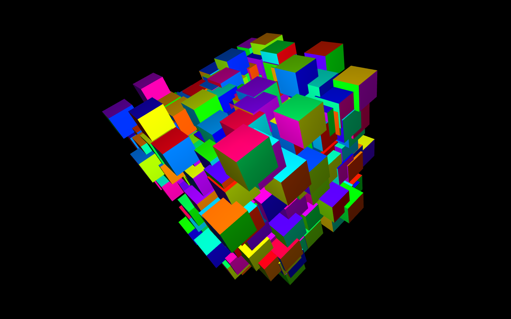

# art-and-code
demo code from the youtube video tutorials and how-tos

using openFrameworks C++ creative coding framework
 http://openframeworks.cc 

 http://youtube.com/danbuzzo

 http://twitter.com/danb_zzo

 ## Using openFrameworks

### kinectPhotoBooth
photobooth using kinect 1 sensor to record, colour, triangulate and save to disc 3D images

### kinect2 NI Particle Painter
using kinect2 and the openNI natural interaction, skeletal tracking toolkit and a particle system to paint with your hands.

### emoji test 
example code in response to questions on the youtube channel, taking the ascii video transform example from the openframeworks creative technology toolkit series and making it work with emojis instead.  

### slitscan-example
### slitscan

two slitscan projects - slitscan example gives a simple overview with a splitsceen view, slitscan is a little more involved showing a different technique to 'push' a ribbon of scan from the centre of the screen to one side, keeping the other side of the screen running as normal video.

### ofZachBlobs

an example of using sine waves for generative animations based on an exmaple by Zach Lieberman 

### 3D Box sketch

using 3D primitives to make a generative, interactive 3D cloud 

