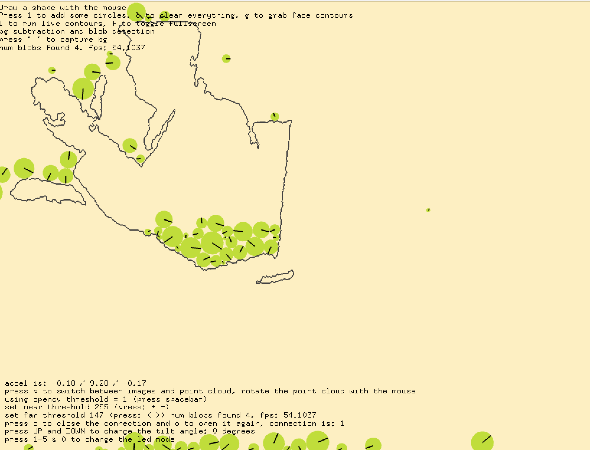
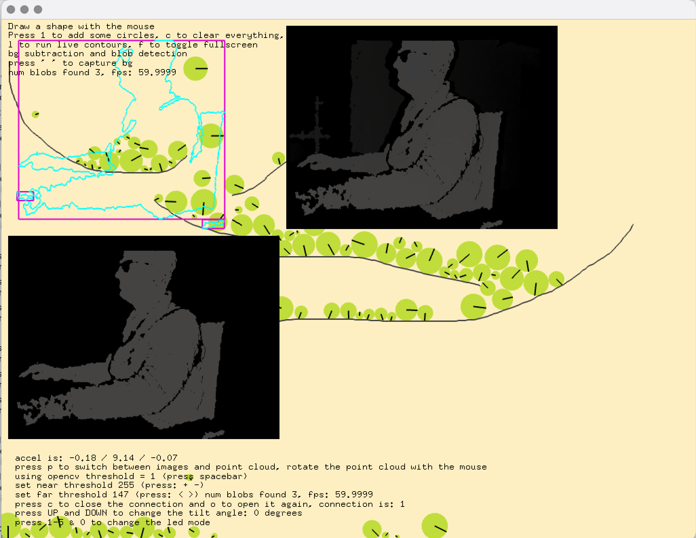

# art-and-code
demo code from the youtube video tutorials and how-tos

Building a  2D physics and openCV example woth with microsoft XBox Kinect sensor

using openFrameworks C++ creative coding framework
 http://openframeworks.cc

http://youtube.com/danbuzzo

http://twitter.com/danb_zzo

### kinect with Box @D and opemnCV
 * using kinect depth sensors to capture RGB & depth data
 * constructing point clouds from depth data
 * cropping then passing threshholded depth image to openCV for coutour finding
 * using the contours extracted by openCV to pass to box2D physics engine
 * detecting collisions with Box2D with particles and our extracted kinect countour line
 * adding sounds triggered by box2D collisions

#### controls
* check onkeypressed routine or onscreen text for current controls
* f toggle fullscreen
* l switch between debug views of kinect and live screen
* c clear contours from screen
* up / down keys tilt kinect up down
* + / -  increase and decrease near threshold on kinect capture
* < / > increase and decrease far threshold on kinect capture

/*
    If you are struggling to get the device to connect ( especially Windows Users )
    please look at the ReadMe: in addons/ofxKinect/README.md
*/