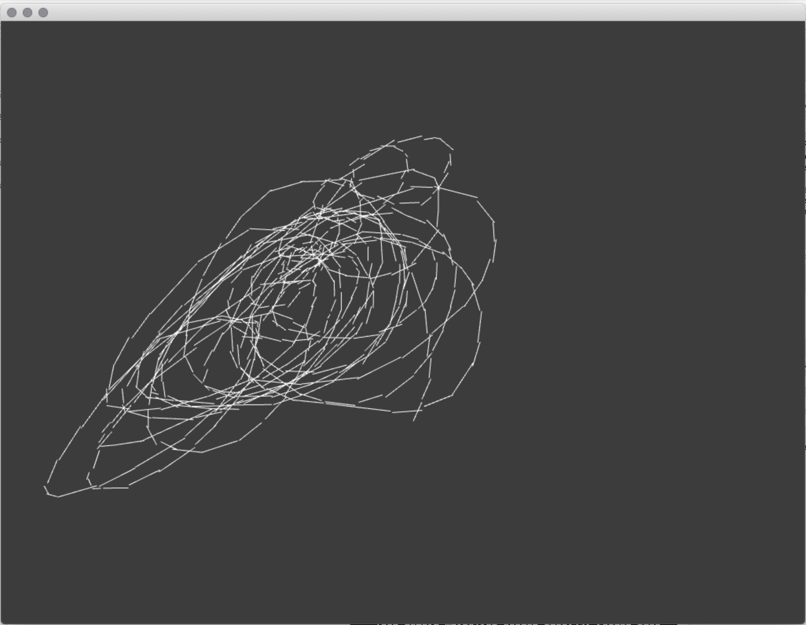

# Generative Systems for Art and Design

youtube.com/danbuzzo

for the art & code youtube tutorial series
©2020 Dan Buzzo

www.buzzo.com

 Examples built in C++ using openFrameworks (openframeworks.cc)
- [Generative Systems for Art and Design](#generative-systems-for-art-and-design)
- [6 main workshop sessions](#6-main-workshop-sessions)
  - [1 Visual expression: generative drawing, weaving and pattern making](#1-visual-expression-generative-drawing-weaving-and-pattern-making)
  - [2 Dice music - mozart and beyond](#2-dice-music---mozart-and-beyond)
  - [3 Text and narrative](#3-text-and-narrative)
  - [4 Procedural generation of environments](#4-procedural-generation-of-environments)
  - [5 Generative systems in industrial design and architecture.](#5-generative-systems-in-industrial-design-and-architecture)
- [Reading lists](#reading-lists)
  - [Core texts](#core-texts)
  - [Recommended reading](#recommended-reading)
  - [extended reading](#extended-reading)
# 6 main workshop sessions

## 1 Visual expression: generative drawing, weaving and pattern making

* Techniques: pattern, walkers, L systems & fractals, conway game of life
* Ideas: generative drawing, editing and pattern making. Making state and extending temporal 'context'
* Demo: random walker, active drawing, Markov Chains, Cellular Automata in 1 & 2D, agents, termites and drunken ants
* Examples: Annie Albers, Vera Molnar, Aaron, Jared Tarbell, Zach Lieberman

## 2 Dice music - mozart and beyond

* Techniques: stochastics, randomness and perlin noise, higher level stochastics, markov chains, probability and randomness - 
* Ideas: lexicons, translations and pattern matching.
* Demo: all techniques & stubs, loops, phasing
  * Random music in the style of 'music for airports'
  * Markov Chain Drum Machine
  * drunken Ant synthesizer
* Examples: Mozart, Eno, KOAN,

## 3 Text and narrative

* Techniques: text sorting, automatic and generative poetry, interactive story structure
* Ideas: Grammar and variation
* Demo: Markov chain text, lexical searches, generating nGrams, automatic writing from grammar structure, POS (part of speech) and lexicons
* Examples: TSR chooose your own adventure, exquisite corpse

## 4 Procedural generation of environments

* Techniques: parameterization and lSystems for algorithmic plant growth
* Ideas: parameters and patterns
* Demo: procedural chairs, procedural forest, 
* Examples: parameterised architecture, procedural level generation

## 5 Generative systems in industrial design and architecture.

* Techniques:
* Ideas:
* Demo:
* Examples: Autodesk, Engineering etc

# Reading lists

## Core texts
* Nature of code : Shiffman, D
* Processing. Casey Reas
* Generative Design
* Form and code
* https://www.artnome.com/news/2018/8/8/why-love-generative-art 

## Recommended reading

* Mozart Dice music: https://www.youtube.com/watch?v=9Zdg6Ec4mVw
* Musikalisches Würfelspiel: https://www.youtube.com/watch?v=fK2MCXpDWB4
* https://medium.freecodecamp.org/an-introduction-to-generative-art-what-it-is-and-how-you-make-it-b0b363b50a70
* https://labs.ideo.com/2014/06/04/painting-with-code/

* Brian Eno: Music systems; examples in javasccript: https://teropa.info/blog/2016/07/28/javascript-systems-music.html
* Generative music: https://medium.com/@metalex9/introduction-to-generative-music-91e00e4dba11

* Annie Albers: https://www.youtube.com/watch?v=E1_fCjuu8sM
* https://www.youtube.com/watch?v=jaBc8R22JKU

* Vera Molnar: https://www.youtube.com/watch?v=6UUB2kplKOU
* Harold Cohen: History of Aaron painting system : https://web.stanford.edu/group/SHR/4-2/text/cohen.html
* https://www.youtube.com/watch?v=ecP9BLg9D88
* https://www.youtube.com/watch?v=IPczQgCuOOc
* https://www.youtube.com/watch?v=MwHQx9BrHQc

* John Whitney https://www.youtube.com/watch?v=TbV7loKp69s
* l systems: Prusinkiewicz, Lindenmayer - 1990 - The Algorithmic Beauty of Plants

* markov chains : http://setosa.io/ev/markov-chains/

* http://www.complexification.net/gallery/machines/substrate/index.php

## extended reading

* https://www.kadenze.com/courses/advanced-generative-art-and-computational-creativity/info
* https://www.oreilly.com/learning/generative-adversarial-networks-for-beginners
* http://blog.hvidtfeldts.net/index.php/generative-art-links/
* Carl Lostrito.'Computational Drawing' 2019, Pub. Applied Research and Design

active drawing

cellular automata

random walkers

random colour palettes

drunken ant drawing

random audio

markov chain drum

automatic writing

[!screenshot](session_3_text/nGrams/screenshot-nGrams.png)
making ngrams for markov chains

text drift

text sorting and manipulation

parameterized chair

lSystem forest generation
