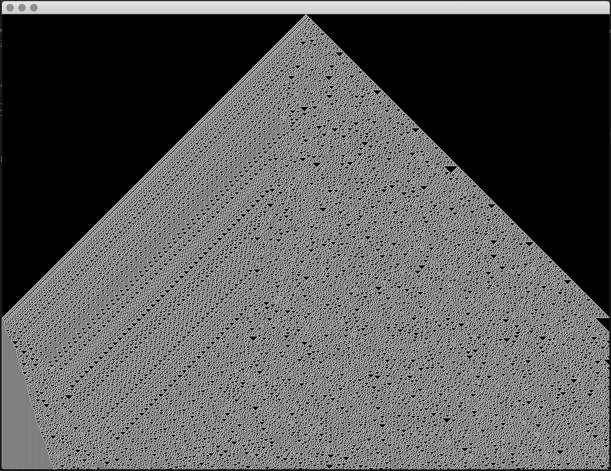
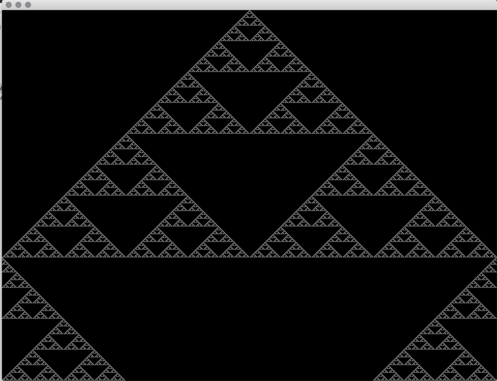
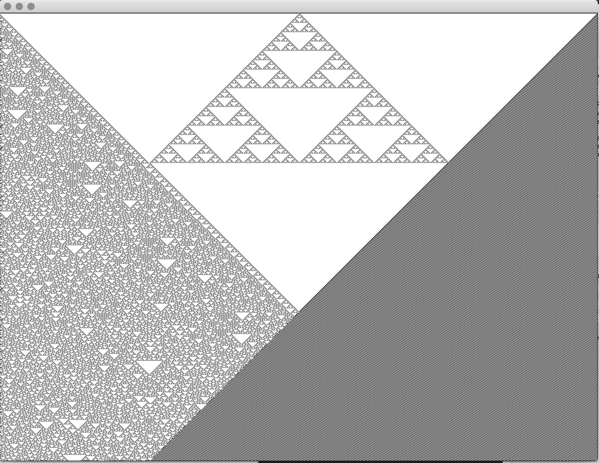

# Generative Systems for Art and Design
 ©2020 Dan Buzzo
 www.buzzo.com

## 1 Visual expression: generative drawing, weaving and pattern making

### Cellular Automata
based on the example from Casey Reas and Ben Fry in 'Processing, A handbook for visual designers and artists'.

