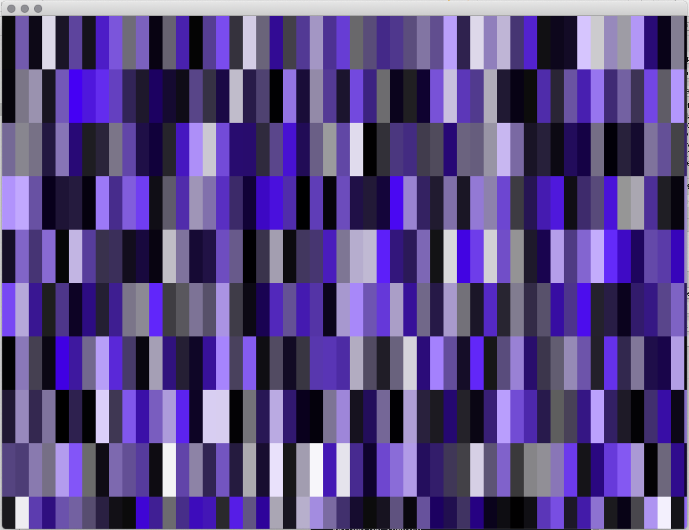

# Generative Systems
Generative Systems for Art and Design course materials
 daniel buzzo 2020
 buzzo.com

## 1 Visual expression: generative drawing, weaving and pattern making

* Techniques: pattern, walkers, L systems & fractals, conway game of life
* Ideas: generative video editing and paint. making state and extending temporal 'context'
* Demo: random HSB colour palette tiles built in c++ openFrameworks (openframeworks.cc)

### Stochastic processes in colour

* Colour Palettes

The colour palette example generates a palette of colours in a vector using random values.
instead of using RGB to describe colour we use HSB - Hue Saturation and Brightness - this makes it easier for us to create palettes of certain kinds of moods, by fixing the brighness value or fixing the saturation or hue we can create palettes that have variation but also similarity.

The code creates a grid of tiles then uses our palette to set the colour of each tile.

You can experiment with different ways to generate our palette colours, or the tile sizes or shapes.
You could  take this into 3D or animate the tiles.

* press 'f' to toggle full screen mode.

