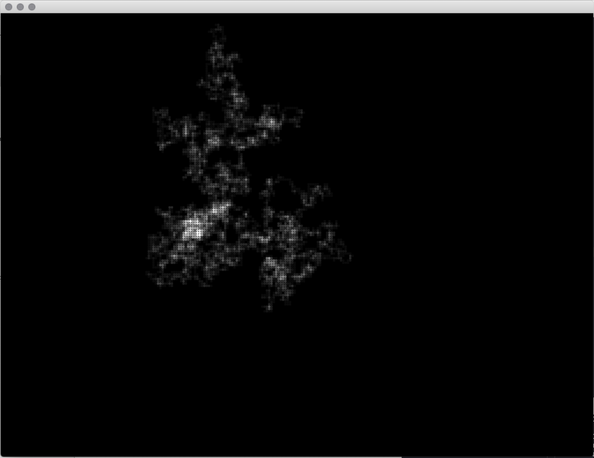

# Generative Systems
Generative Systems for Art and Design course materials
 daniel buzzo 2020
 buzzo.com

## 1 Visual expression: generative drawing, weaving and pattern making

* Techniques: pattern, walkers, L systems & fractals, conway game of life
* Ideas: generative video editing and paint. making state and extending temporal 'context'
* Demo: Random 2D Walker built in c++ openFrameworks (openframeworks.cc)

### Stochastic processes

* Random Walker

The random walker (sometimes called a drunkard's walk) starts from an intial point and moves in a random direction to a new point at a specified distance, from there it moves to a new random point and on and on.
our example can move up, down, left and right with equal probability. It is in essence a Markov chain with 4 states carrying the same probabilty of 0.25 per state (1 chance in 4 of choosing up, down, left or right). This example uses blending to show increasing density of white on screen as the walk crosses over parts of itself. 

You can change the code to alter the dotsize, step distance between each point, alpha blend value etc.

For higher stochastic functions (more interlinked randomness and probabilty complexity) you can alter the step size between each step, the point size we draw or each step or even the alpha value. you could also change the probabilty of which direction a step will take.

You can even extend the walker into 3D by adding a z direction that it could take; up, down, left, right, forwards, backwards. 

