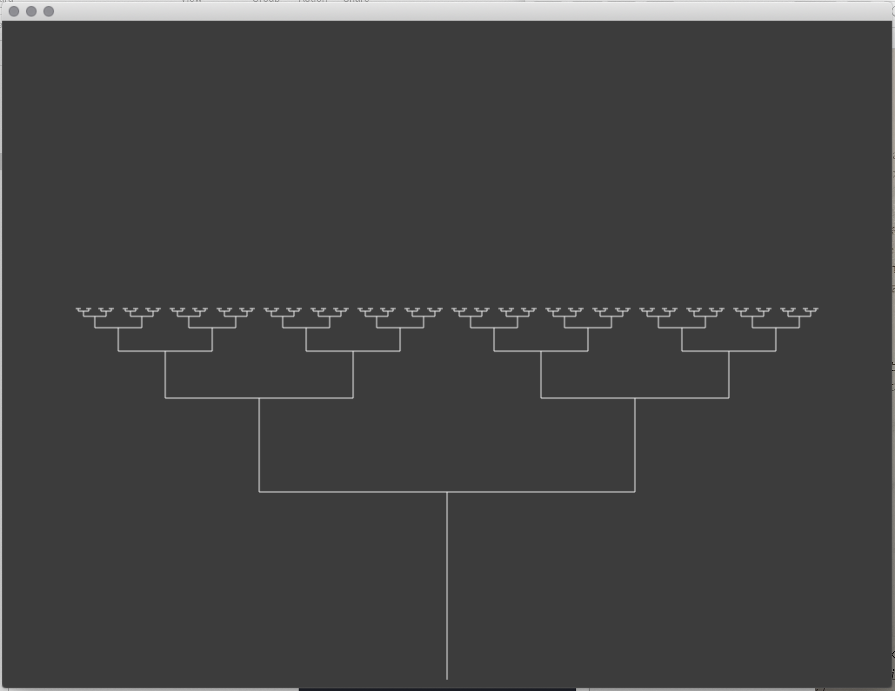

# Generative Systems
Generative Systems for Art and Design course materials
 daniel buzzo 2020
 buzzo.com

## 1 Visual expression: generative drawing, weaving and pattern making

* Techniques: pattern, walkers, L systems & fractals, conway game of life
* Ideas: generative video editing and paint. making state and extending temporal 'context'
* Demo: recursion tree built in c++ openFrameworks (openframeworks.cc)

### Recursion

* recursion Tree

the main function drawTree() calls itself from it's own function creating the tree like recursion

we need to stop the recursion from running away so we count down the number of times the function calls itself

