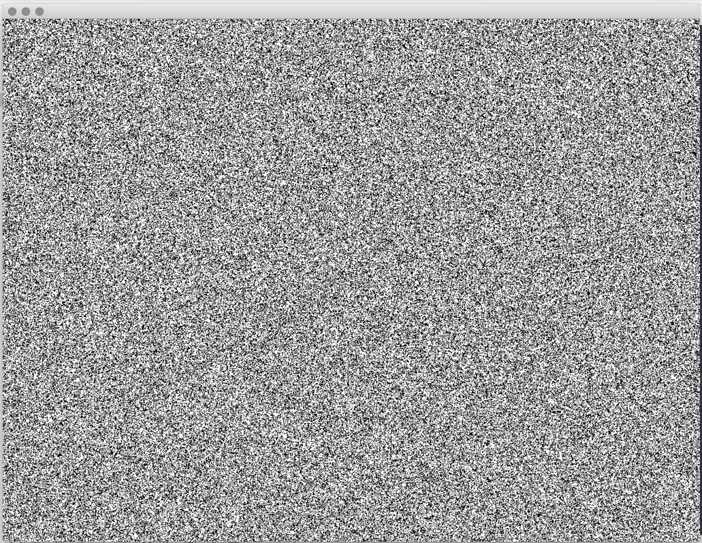

# Generative Systems
Generative Systems for Art and Design course materials
 daniel buzzo 2020
 buzzo.com

## 1 Visual expression: generative drawing, weaving and pattern making

* Techniques: pattern, walkers, L systems & fractals, conway game of life
* Ideas: generative video editing and paint. making state and extending temporal 'context'
* Demo: termite agent example built in c++ openFrameworks (openframeworks.cc)
* inspired by Reas and Fry example in 'Processing:handbook'
* see also the termite Class example to see how this code works as class objects

### Agents

* termite Agents

this simple example shows agent functions (termites) sorting randomly distributed 'wood' into organised 'heaps'

