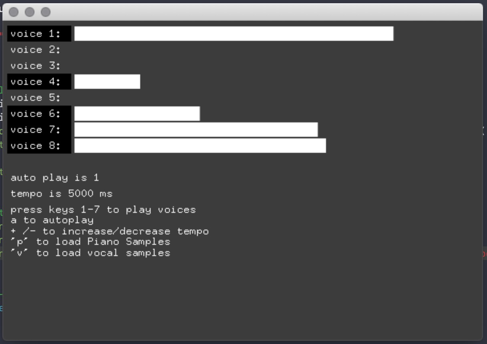

# Generative_systems
Generative Systems for Art and Design course materials
 ©2020 Dan Buzzo
 www.buzzo.com

 Examples built in C++ using openFrameworks (openframeworks.cc)

## 2 Dice music - Mozart and beyond

* Techniques: stochastics, randomness and perlin noise, higher level stochastics, markov chains, probability and randomness - 
* Ideas: lexicons, translations and pattern matching.
* Demo: all techniques & stubs and loops
* Random music in the style of 'music for airports'
* Markov Chain Drum Machine
* drunken Ant synthesizer
* Examples: Mozart, Eno, KOAN,

### reading

Brian Eno's phone apps http://generativemusic.com

how generative music works https://teropa.info/loop/#/title

generative music with javascript https://teropa.info/generative-music-slides/#/title

Brian eno's systems music in Javascript https://teropa.info/blog/2016/07/28/javascript-systems-music.html

introduction to generative music https://medium.com/@metalex9/introduction-to-generative-music-91e00e4dba11
generative FM by Alex Bainter https://generative.fm
and Alex's git hub repo https://github.com/generative-music

stochastic drums https://codepen.io/teropa/pen/PKoYXM

music from helsinki trams https://codepen.io/teropa/pen/mBbPEe

listen to wikipedia http://listen.hatnote.com

listen to the stars  https://eclipticalis.com

dancing markov Gymnopédies https://codepen.io/teropa/pen/bRqYVj

terry riley in c https://teropa.info/blog/2017/01/23/terry-rileys-in-c.html

* "Minimalist Piano Forever" by Mouse Reeve : French composer Erik Satie was the forefather of avant-garde music, the founder of a one-man occult sect, and the inventor of entirely new genres for his hauntingly repetitive, minimalist piano works. Personally, I could listen to his "Gnossiennes" forever, so I created a way to do so, using digital sheet music, markov chains, and browser-based midi to create a generative, unending Gnossienne. This talk will explore the strategies, algorithms, and libraries I used to go from 19th and 20th century piano music to generative audio and on-the-fly sheet music in the browser. It features forays into topics ranging from how to make computer generated music sound more natural, to Erik Satie's very peculiar life. https://www.youtube.com/watch?v=ANYMii3Sypg 

* Loops, phasing   Brian Eno
* Randomness, chance procedures  John Cage
* Algorithmic, cellular automata  Iannis Xenakis
* Interactive, augmentative  Laurie Spiegel
* Learning based, Markov chains   Hiller & Isaacson

* deconstructing Music for Airports 
 * https://reverbmachine.com/blog/deconstructing-brian-eno-music-for-airports
 * In this video, via the BBC, Brian Eno discusses some of the techniques behind his music and demonstrates his current setup for creating and ‘tuning’ systems for creating ambient soundscapes. While the video focuses primarily on the aleatory processes Eno uses, attentive viewers will note that Eno emphasizes his process of listening and refining his compositional rules to meet his aesthetic goals.  https://youtu.be/cv7epY75Wa0

### tools 

openframeworks addon ofxMidi https://github.com/danomatika/ofxMidi
http://notahat.com/simplesynth/ free simple synthesizer

includes eno-esque sounds samples ©Dan Carr : 
care of https://reverbmachine.com/blog/deconstructing-brian-eno-music-for-airports

