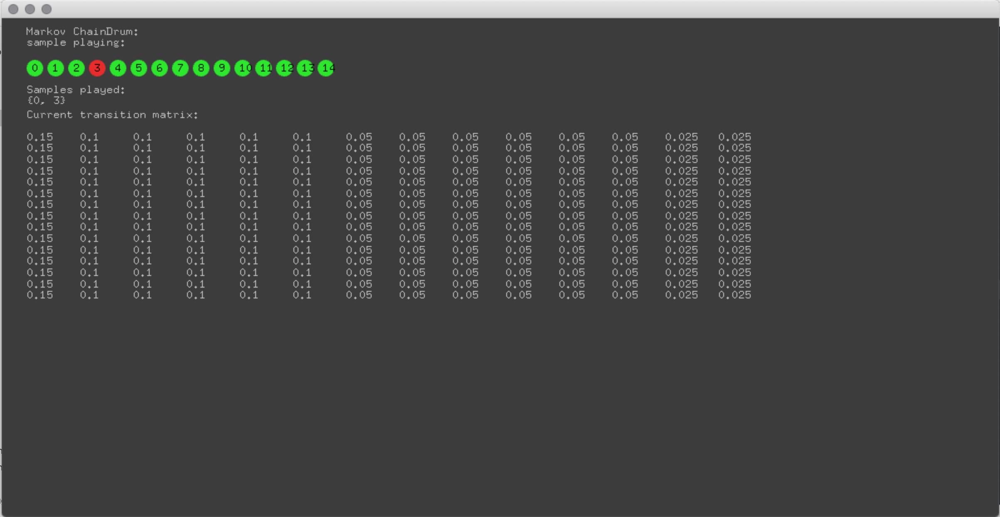

# Generative_systems
Generative Systems for Art and Design course materials
 daniel buzzo 2020
 buzzo.com

## 2 Dice music - mozart and beyond

* Techniques: stochastics, randomness higher level stochastics, markov chains, probability and randomness - 

## Markov ChainDrum

a markkov chain powered drum machine

dependencies ofxMarkovChain
### reading

markov chains : http://setosa.io/ev/markov-chains/

