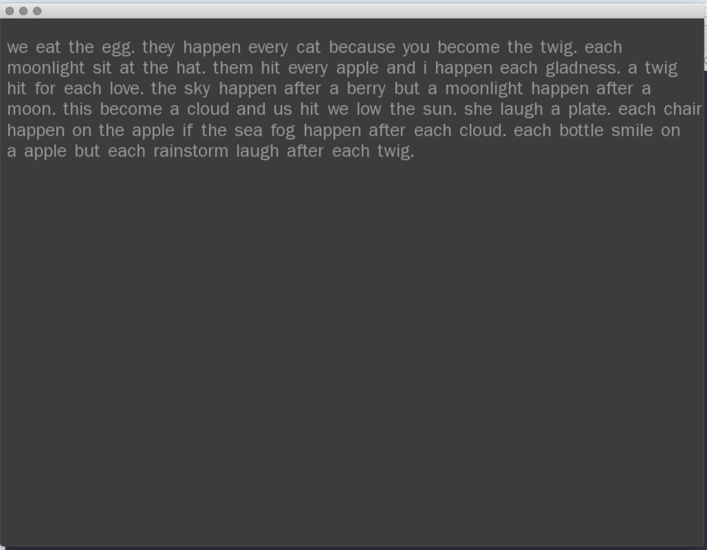
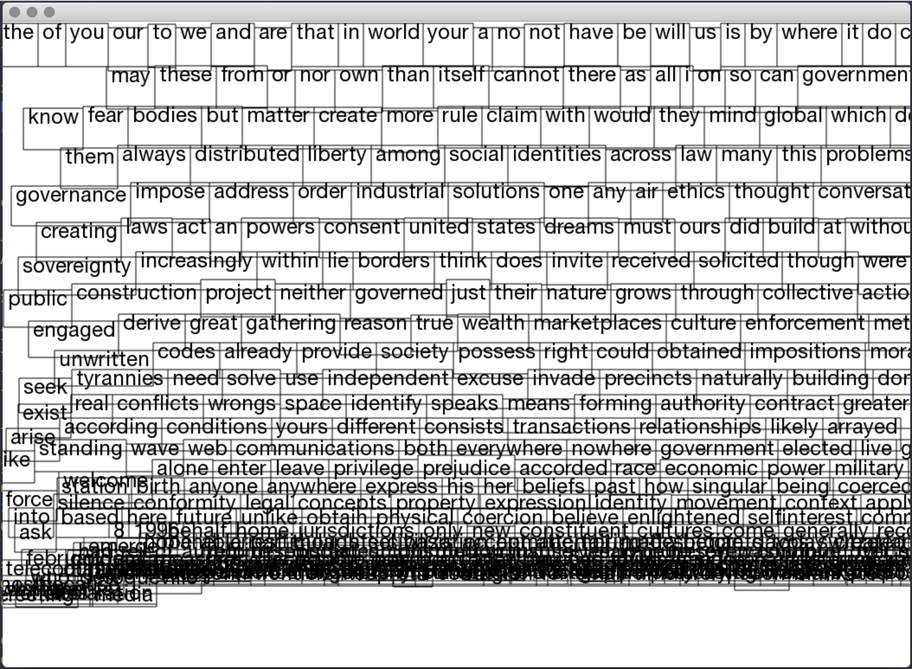

# Generative_systems
Generative Systems for Art and Design course materials
 ©2020 Dan Buzzo
 www.buzzo.com

 Examples built in C++ using openFrameworks (openframeworks.cc)

## 3 Text and narrative

* Techniques: text sorting, automatic and generative poetry, interactive story structure
* Ideas: Grammar and variation
* Demo: Markov chain text, lexical searches. 
  * nGrams and generating models for markov chains
  * screenshot-automaticWriting.png
  * text Drift - manipulating text font characetr outlines
  * textSortingManipulation sorting and scaling text based upon sort order
* Examples: TSR chooose your own adventure, exquisite corpse, 
  

[!screenshot](nGrams/screenshot-nGrams.png)

