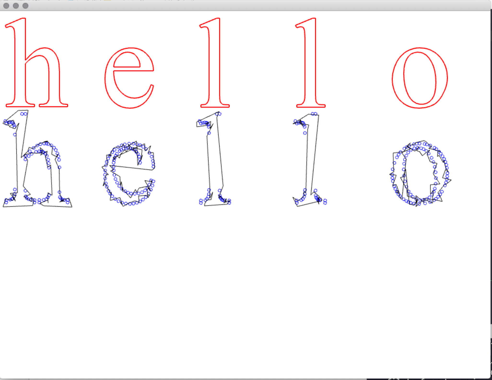

# Generative_systems
Generative Systems for Art and Design course materials
 ©2020 Dan Buzzo
 www.buzzo.com

 Examples built in C++ using openFrameworks (openframeworks.cc)

## 3 Text drift

* Techniques: text sorting, automatic and generative poetry, interactive story structure

  

