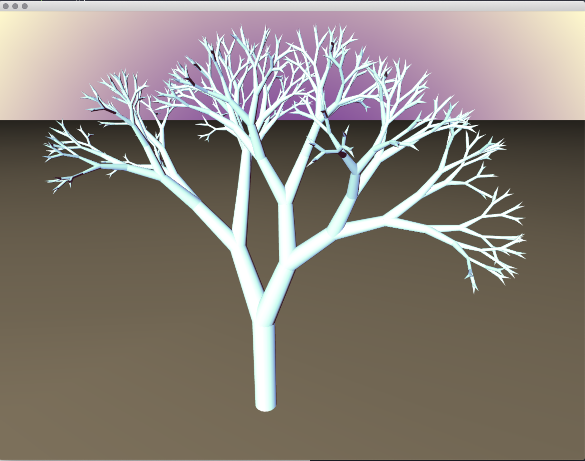
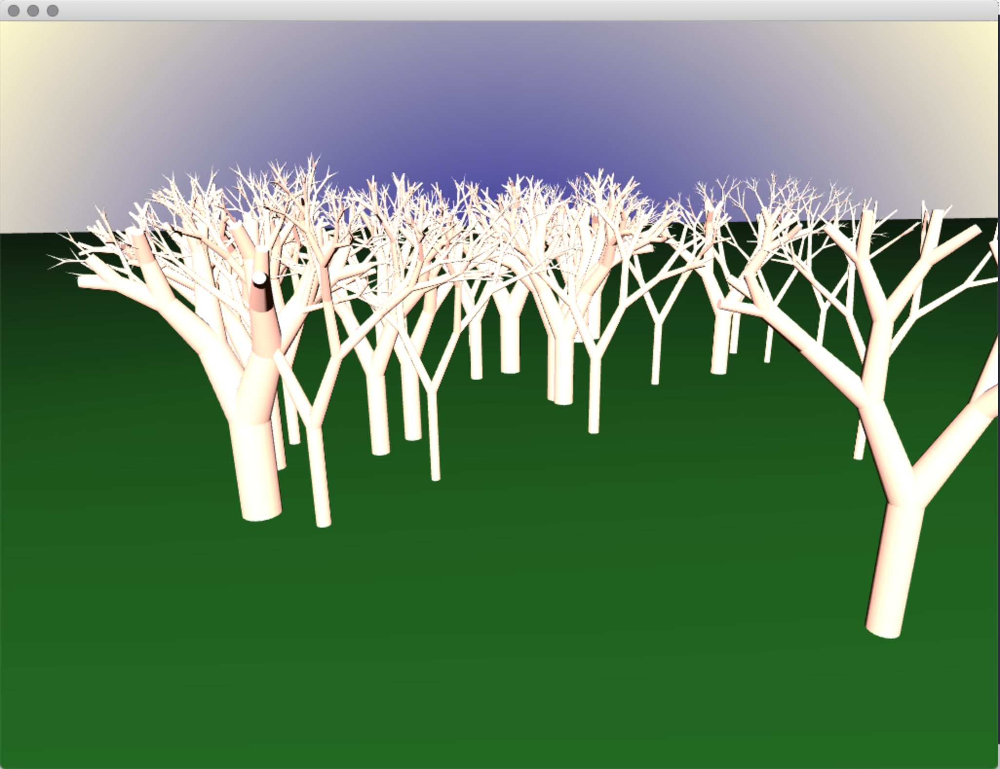
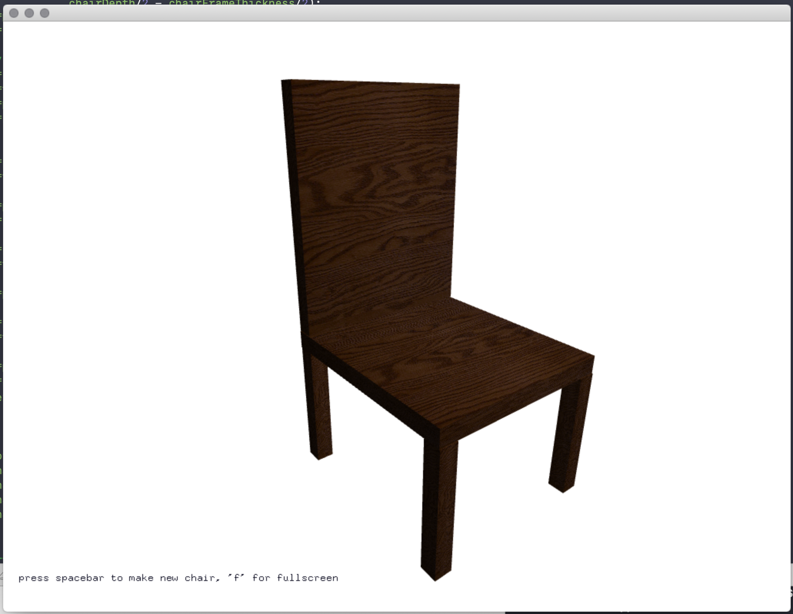
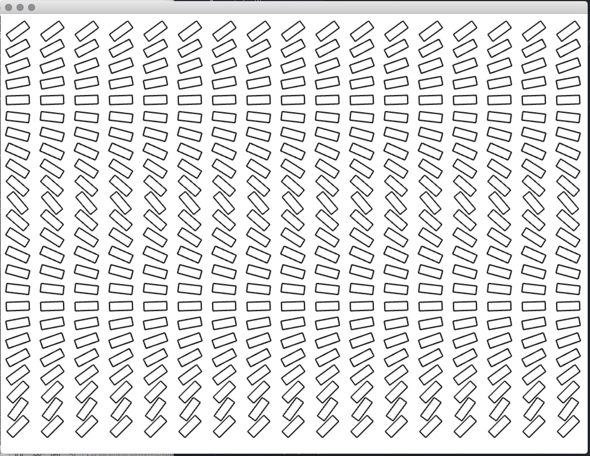

# Generative_systems
Generative Systems for Art and Design course materials
 ©2020 Dan Buzzo
 www.buzzo.com

 Examples built in C++ using openFrameworks (openframeworks.cc)

## 4 procedural environments and parameterization

* https://slsdo.github.io/procedural-dungeon/ making procedural dungeons
* http://pixelenvy.ca/wa/ca_cave.html - using cellular automata to generate a cave
* https://github.com/edap/ofxLSystem

