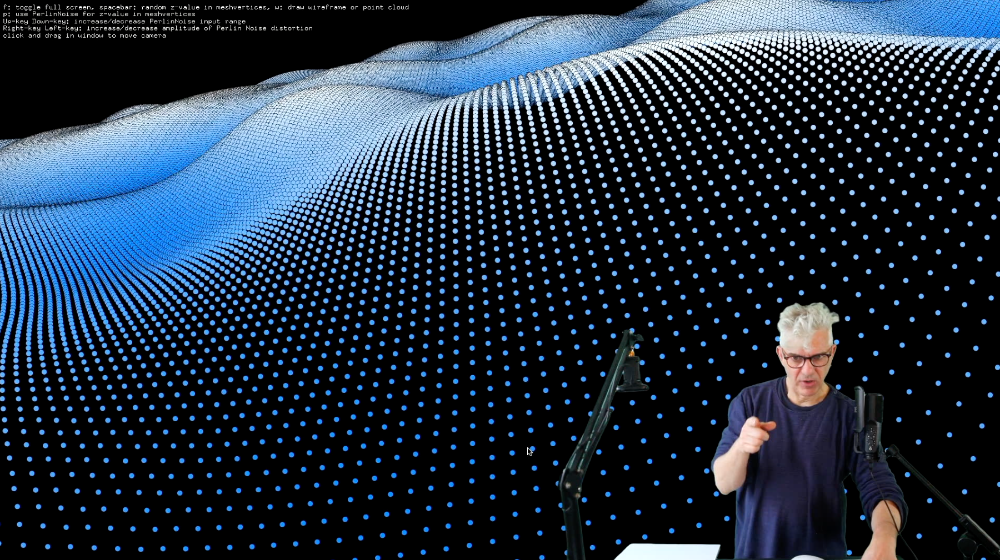

# Dan buzzo art and code

Dan Buzzo, May 2021

https://github.com/danbz
https://youtube.com/danbuzzo

https://buzzo.com

#Mesh, noise and perlin noise Example with animation and color

Simple example to
• generate an openFrameworks (openframeworks.cc) mesh object
• use ofEasyCam to view our 3D scene
• populate it with vertices
• triangulate vertices and add indices to create triangle mesh
• use ofRandom() function to change the vertices z co-ordinates to distort the Mesh
• use 2 dimensional Perlin Noise() function to change the vertices z co-ordinates to distort the Mesh
 
##key controls
• f: toggle full screen 
• spacebar: random z-value in meshvertices
• w: draw wireframe or point cloud 
• p: use PerlinNoise for z-value in meshvertices
• Up-key Down-key: increase/decrease PerlinNoise input range 
• Right-key Left-key: increase/decrease amplitude of Perlin Noise distortion 
• click and drag in window to move camera

